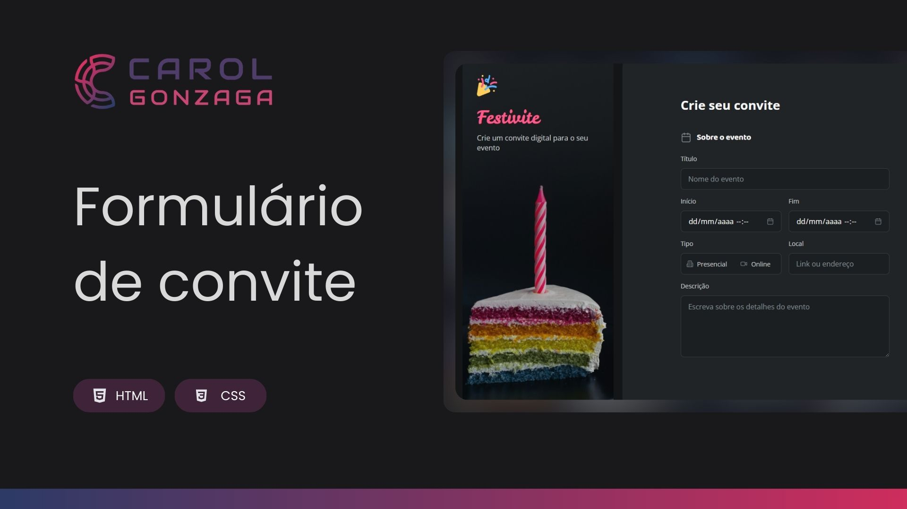

  

 

  Um projeto que apresenta um formulário intuitivo para a criação de convites digitais, com foco em usabilidade e customizações avançadas usando apenas HTML e CSS.

  <a href="#-tecnologias">Tecnologias</a>&nbsp;&nbsp;&nbsp;|&nbsp;&nbsp;&nbsp;<a href="https://carolgonzaga.github.io/formulario-de-convite/">Acesse o Projeto</a>

  

  

  

## 🚀 Tecnologias

Esse projeto foi desenvolvido com as seguintes tecnologias:

- **HTML5**
- **CSS3**
- **JavaScript**

  

## 🎯 Objetivo

O intuito deste projeto é treinar os conceitos sobre formulários e interações aprendidos em aula. Durante o desenvolvimento, foram aplicados diversos conceitos, como:

- **Customização de inputs:**  
  - Calendários customizados com input type="datetime-local"  
  - Estilização de campos de erro com feedback visual

- **Interação e estados dinâmicos:**  
  - Radio buttons e checkboxes personalizados com pseudo-elementos e SVG  
  - Efeitos de hover, foco e seleção aplicados para melhor experiência do usuário

- **Upload de arquivos:**  
  - Customização do input type="file" utilizando labels estilizados e exibição do nome do arquivo selecionado

- **Layout organizado:**  
  - Utilização de Flexbox e CSS Grid para compor a estrutura do formulário  
  - Organização dos fieldsets para separar as seções "Sobre o evento", "Personalização" e "Dados para contato"

